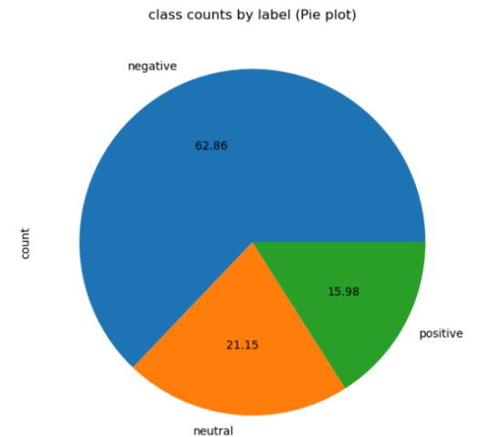

# 🧠 Sentiment Analysis using Semi-Supervised Text Classification

## 📘 Overview
This project explores **semi-supervised sentiment analysis**, an approach that leverages both **labeled** and **unlabeled data** to improve text classification performance.  
It investigates two main paradigms:
- **Self-training**
- **Graph-based learning** (Label Propagation and Label Spreading)

The goal is to overcome challenges such as limited labeled data and class imbalance while maintaining strong model generalization.

---

## 🎯 Objectives
- Demonstrate how semi-supervised methods can enhance traditional sentiment analysis.  
- Evaluate and compare self-training and graph-based classifiers.  
- Handle class imbalance using **SMOTE**.  
- Deploy the best model in a **Flask web application** for real-time sentiment prediction.

---

## 🧩 Dataset
- **Source:** [Twitter US Airline Sentiment Dataset](https://data.world/socialmediadata/twitter-us-airline-sentiment)  
- **Classes:** Negative, Neutral, Positive  
- **Challenge:** Imbalanced distribution of classes

---

## ⚙️ Preprocessing Steps
1. **Text Cleaning:** Removed emojis, links, punctuation, hashtags, and extra spaces.  
2. **Simulated Unlabeled Data:** A portion of labeled samples was converted into unlabeled data.  
3. **TF-IDF Vectorization:** Transformed text into numerical form suitable for ML models.  
4. **Scaling:** Standardized features using `StandardScaler(with_mean=False)` for sparse matrices.  
5. **SMOTE:** Applied during training to balance the dataset and reduce class bias.

---

## 🧠 Semi-Supervised Learning Approaches

### 1️⃣ Self-Training Classifier
Iteratively labels unlabeled data with high-confidence predictions.

**Base Models:**
- Logistic Regression  
- Support Vector Machine (SVM)  
- K-Nearest Neighbors (KNN)  
- Decision Tree  
- Random Forest  
- Naïve Bayes  
- Stochastic Gradient Descent (SGD)  
- XGBoost  

---

### 2️⃣ Graph-Based Classifiers
**Label Propagation** and **Label Spreading** methods were applied using RBF and KNN kernels.  
These algorithms propagate label information through graph structures, leveraging data similarities.

---

## 📊 Performance Evaluation
**Metrics Used:** Precision, Recall, and F1-Score  
(Chosen for their robustness against imbalanced data)

- **Best Model:** Logistic Regression  
- **F1-Score:** 79.8%  

**Advantages:**
- High interpretability  
- Computational efficiency  
- Robustness to irrelevant features  
- Probabilistic output for confidence estimation

---

## 📉 Dataset Class Distribution

The dataset used in this study exhibits an imbalanced class distribution,  
as shown in the figure below. This motivated the use of SMOTE to balance minority classes during training.

  

---

## 🚀 Deployment

### Framework
**Flask Web Application**

### Implementation Steps
1. **Model Export:** The best-performing Logistic Regression model was serialized using `joblib`.  
2. **Integration:** The model was integrated into a Flask app for real-time prediction.  
3. **User Interaction:**
   - Users can input text on the web interface.
   - Text undergoes preprocessing and TF-IDF vectorization.
   - The model predicts and displays the sentiment.

---

## 🎬 Application Demonstration

The following video illustrates the deployment of the Flask-based sentiment analysis web application.  
It demonstrates how users can input text in real time and receive a sentiment prediction (Positive, Neutral, or Negative).

<video src="assets/demo.mp4" controls="controls" width="700"></video>

---

## 🧾 Conclusion
Semi-supervised text classification presents a practical solution for scenarios where labeled data is scarce.  
By combining labeled and unlabeled samples, models become more robust and adaptive to real-world text variability.  

The **Logistic Regression model** demonstrated the best trade-off between interpretability and performance, achieving an **F1-score of 79.8%**.

---

## 🔖 References
1. [Twitter US Airline Sentiment Dataset](https://data.world/socialmediadata/twitter-us-airline-sentiment)  
2. Amini, M.-R. & Feofanov, V. — *Self-Training for Text Classification*  
3. Zhu, X. & Ghahramani, Z. — *Learning from Labeled and Unlabeled Data with Label Propagation*  
4. Chapelle, O., Schölkopf, B., & Zien, A. — *Semi-Supervised Learning* (Book)  
5. [Springer Article: Sentiment Analysis and Emotion Detection](https://link.springer.com/article/10.1007/s13278-021-00776-6)  
6. [Label Propagation Paper (CMU-CALD-02_107)](https://mlg.eng.cam.ac.uk/zoubin/papers/CMU-CALD-02_107.pdf)

---

## 🏆 Acknowledgment
This work was conducted as part of an academic research project on **semi-supervised text classification**.  
It reflects our efforts to bridge the gap between theory and application through practical deployment.

---

